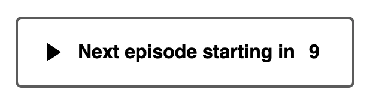

# CountdownButton

React experiment to create a Countdown Button similar to those used on Disney+ when you complete an episode of a series and there is another episode queued up ready to play.

## Available Props

* `children`: Displays in the Button, example includes an SVG Icon and text
* `onComplete`: fires once the timer countdown has reached 0.
* `onClick`: fires when the button is clicked on, this is regardless of whether the timer has reach zero and will also clear the timer interval.
* `totalSeconds`: Start value for counter
* `theme`: An object with parameters for basic styling

Theme object init:
```
theme: {
  bgActive: '#ccc',
  bgColor: '#fff',
  bgHover: '#f2f2f2',
  borderColor: '#666'
}
```

Demo here https://wonderful-darwin-823373.netlify.app/

